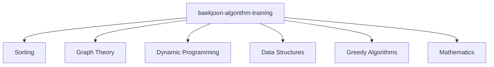

# Baekjoon Algorithm Training

This repository contains solutions and notes 
for algorithm training. It is organized to help track progress and manage solution files effectively. 
Each directory corresponds to a category of algorithms, and each solution is named according to its problem ID on Baekjoon Site or Progammers Site.

---

## 📂 Repository Structure

The repository is organized as follows:

- **Sorting**: Contains problems related to sorting algorithms.
- **Graph Theory**: Contains problems involving graphs, traversals, and graph-related algorithms.
- **Dynamic Programming**: Solutions for dynamic programming problems.
- **Data Structures**: Contains implementations and problem solutions related to data structures.
- **Greedy Algorithms**: Solutions for greedy algorithm problems.
- **Mathematics**: Mathematical problems including number theory, combinatorics, etc.

Each directory includes:
- **Solution Files**: `.java` or `.py` files containing solution code.
- **Explanation Files**: `.md` files explaining the problem approach and solution details.

## 🚀 Getting Started

### Prerequisites

- Ensure you have Java (or Kotlin) installed on your system to run the solution files.
- Basic knowledge of algorithms and data structures is recommended for a better understanding.

### Installation

1. Clone the repository from GitHub.
2. Navigate to the project directory.

---

## 📘 Usage

1. Navigate to a specific algorithm category folder.
2. Open the solution file for a particular problem to see the solution code and explanations.

---

## 📈 Progress Tracker

The following is the approximate distribution of problems solved in each algorithm category:

- **Baekjoon Online Judge**: 50%
- **Progammers**: 50%

---

## 📄 License

This project is licensed under the MIT License - see the [LICENSE](LICENSE) file for details.

---

## 📬 Contact

For any questions or suggestions, please reach out to yunyoung1819@gmail.com

---

Happy coding and good luck with your algorithm training on Baekjoon!